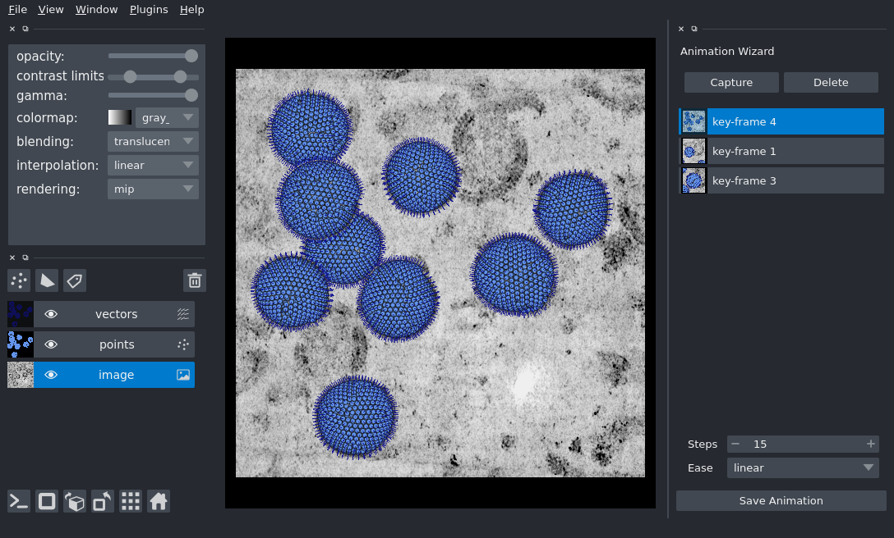

# napari-animation (WIP under active development)

[](https://github.com/napari/napari-animation/raw/main/LICENSE)
[](https://pypi.org/project/napari-animation)
[](https://python.org)
[](https://github.com/napari/napari-animation/actions)
[](https://codecov.io/gh/napari/napari-animation)

**napari-animation** is a plugin for making animations in [napari].

----------------------------------

This [napari] plugin was generated with [Cookiecutter] using with [@napari]'s [cookiecutter-napari-plugin] template.

It is built off of great work from @guiwitz in [naparimovie](https://github.com/guiwitz/naparimovie) which was initially submitted to napari in [PR#851](https://github.com/napari/napari/pull/780).

----------------------------------
## Overview

**napari-animation** provides a framework for the creation of animations in napari and features:
- an easy to use GUI for interactive creation of animations
- Python tools for programmatic creation of animations

This plugin is currently pre-release and under active development. APIs are likely to change before it's first 0.0.1 release,
but feedback and contributions are welcome.

## Installation

You can clone this repository with install locally with

    pip install -e .

## Examples
Examples can be found in our [examples](examples) folder. Simple examples for both interactive and headless 
use of the plugin follow.

### Interactive
**napari-animation** can be used interactively by creating an `AnimationWidget` from a napari `Viewer` and adding it to
the viewer as a dock widget.

```python
from napari_animation import AnimationWidget

animation_widget = AnimationWidget(viewer)
viewer.window.add_dock_widget(animation_widget, area='right')
```



### Headless
**napari-animation** can also be run headless, allowing for reproducible, scripted creation of animations.

```python
from napari_animation import Animation

animation = Animation(viewer)

viewer.dims.ndisplay = 3
viewer.camera.angles = (0.0, 0.0, 90.0)
animation.capture_keyframe()
viewer.camera.zoom = 2.4
animation.capture_keyframe()
viewer.camera.angles = (-7.0, 15.7, 62.4)
animation.capture_keyframe(steps=60)
viewer.camera.angles = (2.0, -24.4, -36.7)
animation.capture_keyframe(steps=60)
viewer.reset_view()
viewer.camera.angles = (0.0, 0.0, 90.0)
animation.capture_keyframe()
animation.animate('demo.mov', canvas_only=False)
```

## Is everything animate-able?

Unfortunately, not yet! Currently differences in the following objects are tracked by the `Animation` class

- `Viewer.camera`
- `Viewer.dims`
- `Layer.scale`
- `Layer.translate`
- `Layer.rotate`
- `Layer.shear`
- `layer.opacity`
- `Layer.blending`
- `Layer.visible`

Support for more layer attributes will be added in future releases.

## Contributing

Contributions are very welcome and a detailed contributing guide is coming soon. 

Tests are run with `pytest`.

We use [`pre-commit`](https://pre-commit.com) to sort imports with
[`isort`](https://github.com/timothycrosley/isort), format code with
[`black`](https://github.com/psf/black), and lint with
[`flake8`](https://github.com/PyCQA/flake8) automatically prior to each commit.
To minmize test errors when submitting pull requests, please install `pre-commit`
in your environment as follows:

```sh
pre-commit install
```


## License

Distributed under the terms of the [BSD-3] license,
"napari-animation" is free and open source software

## Issues

If you encounter any problems, please [file an issue] along with a detailed description.

[napari]: https://github.com/napari/napari
[Cookiecutter]: https://github.com/audreyr/cookiecutter
[@napari]: https://github.com/napari
[BSD-3]: http://opensource.org/licenses/BSD-3-Clause
[cookiecutter-napari-plugin]: https://github.com/napari/cookiecutter-napari-plugin
[file an issue]: https://github.com/sofroniewn/napari-animation/issues
[napari]: https://github.com/napari/napari
[tox]: https://tox.readthedocs.io/en/latest/
[pip]: https://pypi.org/project/pip/
[PyPI]: https://pypi.org/